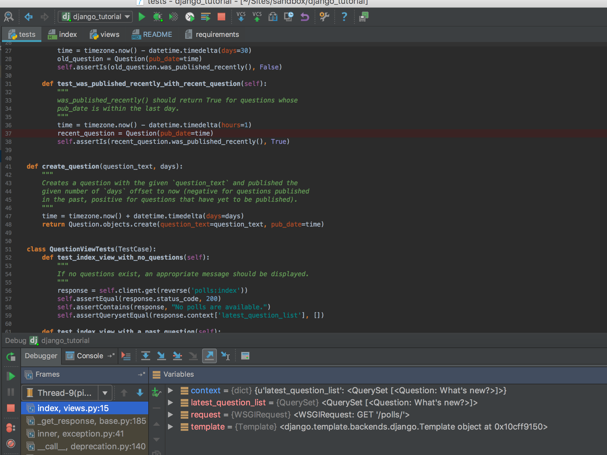

Go through the commits to learn each step of Django and it's basics. 

#### 0. Prepare environment for dev
First, navigate to the Django project root folder.

```
$ cd /path/to/project
```

Next, create the virtual env in the `env/` folder.

```
$ pip install virtualenv
$ virtualenv env/
```

Now you can activate and deactivate the virtual environment. To activate
the virtual environment, perform the following.

```
$ source env/bin/activate
```

Finally, install the required packages. The packages and their versions are
in the `requirements.txt` file, and pip can be used to install them all
at once.

```
$ pip install -r requirements.txt
```
Note: Don't do this until you are finished working on the project. To
deactivate the virtual environment, perform the following.

```
$ deactivate
```


#### 1.  Create Project
```
$ django-admin.py startproject mysite
```

Creates file structure:
```
mysite/
     manage.py
     mysite/
          __init__.py
          settings.py (db, 
          urls.py
          wsgi.py
```


##### Run server

The development server automatically reloads Python code for each request as needed. You don’t need to restart the server for code changes to take effect. However, some actions like adding files don’t trigger a restart, so you’ll have to restart the server in these cases.

```
$ python manage.py runserver
$ python manage.py runserver 0.0.0.0:9999
```

#### 2. Create an app 

```
$ python manage.py startapp polls 
```

Creates ‘mysite/polls’ file structure:
```
polls/
    __init__.py
    admin.py
    apps.py (Configuration for this 'polls' application)
    migrations/
        __init__.py
    models.py
    tests.py
    urls.py (Manually created this file, similar to routes.rb)
    views.py (similar to controllers/)
```

#### 3. Create models and migrations

```
$ python manage.py showmigrations
$ python manage.py makemigrations polls
$ python manage.py sqlmigrate polls 0001
$ python manage.py migrate (applies migrations to DB, of INSTALLED_APPS)
$ python manage.py migrate my_app migration_that_you_want_to_revert_to
```

#### 4. (Good) Play in the Shell

```
$ python manage.py shell
```

#### 5. (Better) Or play in the shell_plus with Django Extensions

```
$ pip install django-extensions (then add INSTALLED_APPS='django_extensions')  
$ python manage.py shell_plus

$ python manage.py runserver_plus
$ python manage.py show_urls
$ python manage.py validate_templates
$ python manage.py graph_models -a -o myapp_models.png
```

#### 6. (Best) Or install ipython and use shell with notebooks (for quickest reloading and saving)

```
$ python manage.py shell_plus --notebook
$ pip install ipython
$ pip install "ipython[notebook]"
```

#### 7. Work in the Django admin

First we’ll need to create a user who can login to the admin site. Run the following command:
```
$ python manage.py createsuperuser
```

#### 8. Adding templates to remove hard coding from views
 See commit diff

#### 9. Test your application
```
$ python manage.py test
$ python manage.py test polls
```

#### 10. CircleCI
```
https://circleci.com/gh/kamilski81/django_tutorial
```

#### 11. Use DEBUG mode in Unit tests, or when you are debugging the server.



#### 12. Use HTML forms to gather data
https://docs.djangoproject.com/en/1.11/intro/tutorial04/

#### 13. Adding Celery and Redis
 See commit diff and run following from root directory:
 
```
$ celery -A polls.tasks worker --loglevel=info
```
